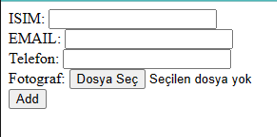
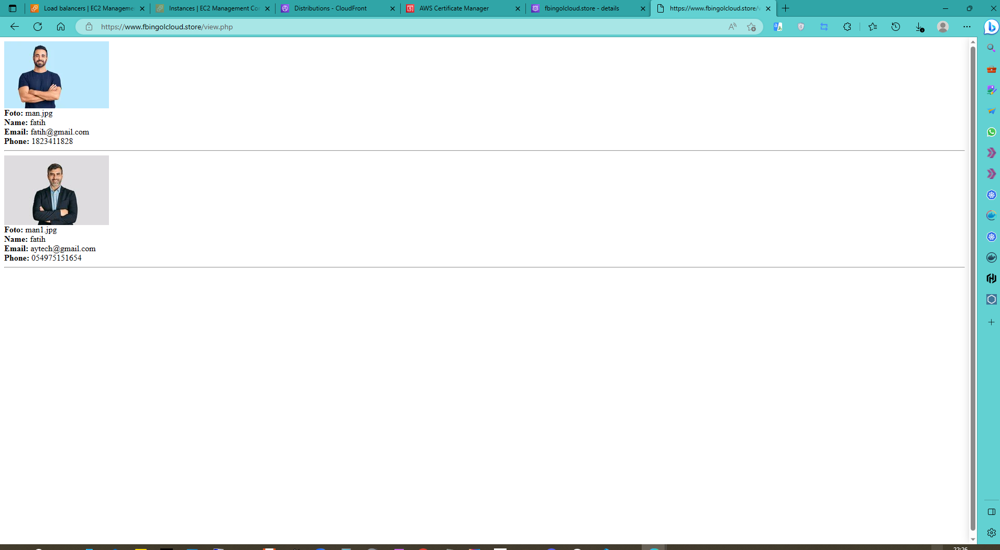

# Kullanıcı Bilgi Girişi Web Uygulaması
## User Information Entry Web Application

Php dilinde yazılmış bir web uygulamasını production ortamında kuruyoruz. Uygulamamız basit bir kullanıcı kaydı uygulaması. Bu uygulama Autoscaling group içerisinde yaratacağımız EC2 sanal makinelerde duracak. Autoscaling group her bir public Subnet'imizde en az bir tane olmak üzere en az 3 sanal makine yaratacak. Bu sanal makineler %9o'dan fazla cpu kullanımı yaparsa da bunları 5 adet sanal makineye kadar çoğaltacak. Tüm bu sanal makineleri yaratacağımız bir Load Balancer arkasına alarak yük dağılımı sağlayacağız. Daha sonrasında da bu loadbalancer'ı yaratacağımız bir CloudFront dağıtımıyla tüm dünyadan hızlı şekilde erişilir hale getireceğiz ve Route53 dns hizmetini kullanarak da bu web tabanlı uygulamamızı www.proje.com gibi bir url'den erişilebilir hale getireceğiz.
Uygulamamız, kullanıcılarımızın isim, email adresi ve telefon bilgilerini girerek bir adet de resim yüklemelerine imkan verecek. Kullanıcılar bilgileri girip tamam tuşuna bastıkları zaman seçtikleri resim EC2 makinelerin ortaklaşa kullandıkları EFS sürücüsüne yazılacak. İsim email ve telefon bilgileri de RDS veritabanımıza kaydedilecek. Sonrasında kullanıcıların yükledikleri bu resimler yarattığımız bir S3 bucket'a kopyalanacak. Bu aşamada bir Lambda fonksiyonu çalışacak. S3 bucket'a yüklenen her obje bu lambda fonksiyonunu tetikleyecektir. Bu fonksiyon ise bu bucket'a yüklenen resmi alacak ve onu 100x100 piksellik küçük bir resim haline getirecek ve ardından da bunu yaratmış olduğumuz 2. Bucketa kaydedecek.

We are installing a web application written in PHP in the production environment. Our application is a simple user registration application. This application will stay on EC2 virtual machines that we will create within the Autoscaling group. The Autoscaling group will create at least 3 virtual machines, at least one in each of our public Subnets. Even if these virtual machines use more than 90% CPU, it will replicate them up to 5 virtual machines. We will provide load distribution by taking all these virtual machines behind a Load Balancer that we will create. Afterward, we will make this load balancer quickly accessible from all over the world with a CloudFront distribution that we will create, and we will make this web-based application accessible from a URL such as www.proje.com by using the Route53 DNS service.
Our application will allow our users to upload a picture by entering their name, email address, and phone information. When users enter the information and press the OK button, the image they choose will be written to the EFS driver shared by EC2 machines. Name, email, and phone information will also be saved in our RDS database. Afterward, these images uploaded by users will be copied to an S3 bucket we created. A Lambda function will run at this stage. Every object uploaded to the S3 bucket will trigger this lambda function. This function will take the image uploaded to this bucket and convert it to a small 100x100 pixel image and then save it to the 2nd Bucket we have created.

## İlk olarak sizlerden bir VPC yaratmanızı istiyorum.
1: Eğer eğitimin VPC bölümünde oluşturduğumuz VPC'i sildiyseniz o bölüme tekrar dönerek adım adım takip edin ve 3 Public subnetten oluşan bir VPC oluşturun.

## İki adet S3 bucket yaratarak daha sonra uygulamamız tarafından yüklenen resimleri burada depolayacağız. İlk Bucket resimleri saklayacak, ikinci bucket ise Lambda fonksiyonumuzun yaratacağı resmin küçük boyutlu kopyalarını saklayacak. 
2: S3 servisine geçerek ismi projeisminiz olan bir bucket oluşturun. ve içerisine de images adında bir klasör yaratın
3: S3 servisine geçerek ismi projeisminiz-resized "yani yarattığınız s3 bucketının isminin sonuna tire "-" ve ardından resized eklenmiş yeni bir s3 bucket yaratıyorsunuz. bu isimlendirme önemli" olan bir bucket oluşturun. Bucket oluşturuken 2. aşama olan "Configure options" kısmındaki  "Manage public access control lists (ACLs) for this bucket" ve "Manage public bucket policies for this bucket" seçeneklerinin altındaki 4 işareti de kaldır. 
Hemen ardından bu S3 bucketa aktarılan tüm objelerin public access'e sahip olması için gerekli Bucket Policy'i yaratın ve tanımlayın. Sonrasında da CORS ayarlarına geçin ve * orjinden GET PUT POST methodlarına izin verecek ayarı yapın.  (repo içinde bucket_policy.txt dosyasında bulabilirsiniz scripti...)

## Proje boyunca ihtiyacımız olacak IAM roleleri yaratıyoruz.
4: IAM servisine geçin. 2 adet IAM role yaratın. Birincisi isim olarak Lambda-S3 olsun, servis olarak Lambda'yı seçecek ve Policy olarak da AWSLambdaExecute seçilecek. İkincisi isim olarak Ec2-S3 olsun, servis olarak EC2 seçili olacak ve AWSS3FullAccess policy seçilecek. Birincisi Lambda servisinin s3'ten dosya okuyup yazmasını sağlayacak, ikincisi ise Ec2 makinelere atanacak ve aynı şekilde S3'den dosya okuyup yazma imkanı sağlayacak. 

## Sırada ilk S3 bucketına koyulan resmi 100x100 ebatına küçülterek ikinci S3 bucketına kopyalayacak Lambda Fonksiyonunu yaratıyoruz.
5: Lambda servisine geç. Yeni fonksiyon yarat. Runtime Node.js 8.10 olsun. Role olarak Lambda-S3'u seç. Yarat. Code Entry Type kısmında Upload a zip file'ı seç ve ImageResize.zip dosyasını seç ve Save et. Ardından Trigger kısmından S3'u seç, bucket olarak projeisminiz bucket'ı seçili olsun ve All Object Create Events seçili olsun. Hepsini Save et. Son olarak da Basic Settings altında timeout değerini 10 sn yap ve Save et.

6: projeisminiz bucket'ına bir jpg dosya upload et. Sonra bak bakalım projeisminiz-resized bucketında küçük versiyonu oluşturulmuş mu? Evet ise Lambda fonksiyonunu başarıyla oluşturdun. 

##Proje süresince kullanacağımız Security Group'u yaratıyoruz.
7: Proje sonuna kadar kullanacağın Proje-SecGroup adında bir Security Group yarat. 0.0.0.0 yani heryerden http 80 ve ssh 22 portlarına izin ver.

## Template olarak kullanacağımız ve ayarlama yapacağımız EC2 Instance'ımızı yaratıyoruz. 
8: Yeni bir Ec2 instance yarat. T2 micro olsun. Amazon Linux 2 Ami ile yarat. Public subnetlerden birine koy, Ec2-S3 rolünü ata ve security group olarak da Proje-SecGroup ata. Bu senin template makinen olacak. Tüm işlemleri bunun üstünde yapacağız ve sonrasında bundan AMI yaratıp diğer makineleri de bu AMI'dan yaratacağız. 

## Makineye httpd mysql php7.2 paketlerini kurarak httpd servisinin makine her başlatıldığında otomatik başlaması için ayar yapıyor ardından da herşeyi düzgün yüklediğimizi kontrol ediyoruz
9: Yarattığın makineye bağlan. Öncelikle tüm paketleri yum paket yöneticisi ile güncelle.  
10: Yum paket yöneticisini kullanarak httpd, mysql paketlerini kur. 
11: amazon-linux-extras paket yöneticisini kullanarak php7.2 paketini kur. 
12: httpd servisinin makine her başlatıldığında otomatik olarak çalışması için ayar yap. 
13: httpd servisini restart et. 
14: /var/www/html klasörüne geç ve test.php adında bir dosya yarat ve içerisine 
<?php
 phpinfo();
?>
komutunu ekle ve kaydet. Ardından kendi makinende browser aç ve http://ec2makinenin_ip_adresi/test.php adresine git. Eğer sayfa açılıp da Php versiyon bilgilerini gösteriyorsa makineye Php yüklemen başarıyla tamamlanmıştır. Tebrikler. (repo içinde tool kurulum script komutlarını "instance_install_tools_comm.txt" dosyasında bulabilirsiniz...)

## Tüm dosyaları ortak bir alanda tutmak adına EFS servisinden yardım alıyor ve bir EFS File System yaratıyoruz. Ve EC2 ile bu servis arasında bağlantı kurmak adına gerekli Security Group ayarlarını yapıyoruz
15: Şimdi sırada EFS var. EFS servisine git ve yeni bir file sistem yaratmaya başla. Vpc olarak doğru VPC'yi seç Subnet olarak public subnetlerinin tamamını seç. Security Group olarak da Default Security group seçili olsun. Yaratılan EFS File System'in fs-6971afa1 şeklinde bir ismi olacak, bunu not al. 

16: Ec2 servis ekranında Securtiy Group'a geç. Buradan bu vpc'nin default security group'unu bul. Inbound rules kısmına yeni bir kural ekle. Servis olarak NFS TCP 2049 portu seçilecek. Source kısmında ise Custom seçeneğini seçerek listeden Proje-SecGroup seç. Böylece Proje-Secgroup'un atandığı EC2 makineler EFS File System'e ulaşabilecekler. 

## EFS File systemi makineye mount etme sırası geldi. 
17: Tekrar oluşturduğun sanal makineye geri dön. Yum paket yöneticisini kullanarak amazon-efs-utils paketini yükle. 
18: /var/www klasörüne geç
19: Yaratmış olduğun EFS File system'i /var/www klasöründe bulunan html klasörüne mount et. Bu sayede html klasöründeki tüm dosyalar aslında EFS File System'de duracaklar. İlgili komutu EFS servisinin ekranından öğrenebilirsin. 

20: Root'a düş ve ardından /etc klasörüne gir. Bu klasörde fstab adında bir dosya var. Bu dosyayı text editörle editle ve ilk satırına aşağüıdakini gir. Tabi baştaki efs file sistem ismini kendi efs file system isminle değiştir. Bu sayede makine her yeniden başladığında mount işlemini otomatik gerçekleştirecek. 
fs-6971afa1:/ /var/www/html efs defaults,_netdev 0 0

21: Tekrar /var/wwww/html klasörüne geri dön ve mkdir images komutuyla images adında yeni bir klasör yarat. Ardından chmod 777 images komutuyla da bu klasöre fazla olmuş olsa da php uygulamamızın dosya kaydedebilmesi için gerekli hakkı ver. 

## Şimdi veri tabanımızı yaratalım
22: Sırada RDS veri tabanımızın yaratılması var. RDS servisine geç ve yeni bir veritabanı yarat. Engine olarak MySql seç. Dev/Test - MySQL ile devam et ve instance class olarak t2.micro seçili olsun. Create replica in different zone seçeneğini işaretle ki failover olarak kurulsun. Aşağıdaki bilgileri girerek devam et. 
instance identifier: projedbinstance
master username: projemaster
password: master1234

Vpc seç ve public access'de No seçeneğini işaretle. Create new VPC security group seçeneği seçili olsun bu sayede yeni bir Security Group yaratacak. Database name: proje   olacak şekilde değiştir ve diğer ayarları aynen bırak ve veritabanı yaratılsın. Ardından veritabanının yaratılmasını bekle bağlanacağın projedbinstance.cqub0g199gzf.eu-west-1.rds.amazonaws.com  benzeri URL'sini not et.

23: EC2 servisi altında bulunan Security Group kısmına gel ve az önce RDS için yaratılan Security Group'u bul. Eğer ismini hatırlamazsan RDS'e döne ve hangi Security Group olduğuna bak. Inbound role ekle. Mysql 3306 portundan source kısmında ise Custom seçeneğini seçerek listeden Proje-SecGroup seç. Böylece EC2 sanal makineler RDS veri tabanımıza erişebilecekler. 

24: Ec2 makinene geri dön. Şimdi bu makine üzerinden mysql komutunu kullanarak RDS veritabanımıza bağlanacak ve orada yeni bir tablo yaratacağız. EC2 sanal makine shell'inde mysql -h projedbinstance.cqub0g199gzf.eu-west-1.rds.amazonaws.com -P 3306 -u projemaster -p  komutunu gir. Tabiki de veritabanı url'sini kendi sistemine göre yaz. şifre soracak. master1234 şifresini gir. Ve tebrikler rds veritabanına bağlandın.

25: Öncelikle USE proje; komutuyla proje veri tabanına geç.

26: CREATE TABLE visitors (name VARCHAR(30), email VARCHAR(30), phone VARCHAR(30), photo VARCHAR(30));
komutunu gir ve visitors adında bir tablo yarat. 

27: show Tables;  komutunu vererek tablonun yaratıldığını gör ve exit komutuyla mysql bağlantını sonlandırıp EC2 shell'e geri düş. 

## Artık sıra uygulamamızı yaratmaya geldi.

28: Bilgisayarımıza geri dönelim ve Proje/Php Uygulama klasörüne geçerek add.php dosyasını bir text editörle açalım. 

$servername = "projedbinstance.cqub0g199gzf.eu-west-1.rds.amazonaws.com";

değişkenindeki değeri kendi RDS veritabanımızın adresiyle değiştirelim ve kaydedelim. 

29: Şimdi de aynı klasördeki view.php dosyasını açalım

$servername = "projedbinstance.cqub0g199gzf.eu-west-1.rds.amazonaws.com";

değişkenindeki değeri kendi RDS veritabanımızın adresiyle değiştirelim ve kaydedelim. 
Bunun yanında

Echo "<img src=https://s3-eu-west-1.amazonaws.com/projeisminiz-resized/resized-images/"

değerini de kendi s3 bucket adresimizle değiştirelim. 

30: Ec2 template makinemize geçelim. Önce index.html diye bir dosya yaratalım ve Proje/Php Uygulama klasöründe bulunan index.html dosyasının içeriğini buraya yapıştıralım ve kaydedelim.

31: Aynı şekilde add.php diye bir dosya yaratalım ve Proje/Php Uygulama klasöründe bulunan index.html dosyasının içeriğini buraya yapıştıralım ve kaydedelim.

32: Aynı şekilde view.php diye bir dosya yaratalım ve Proje/Php Uygulama klasöründe bulunan index.html dosyasının içeriğini buraya yapıştıralım ve kaydedelim.

## Bu noktada yeni bir script yaratıyoruz. Bu script images klasörüne yüklenen tüm resimleri S3 bucketımıza kopyalayacak. Bu sayede de Lambda fonksiyonu tetiklenecek ve bu resmin küçük bir kopyası yaratılacak. 

33: Aynı klasörde s3.sh diye bir dosya yaratın ve aşağıdakini modifiye ederek dosyanın içerisine yapıştırıp kaydedin.
#!/bin/bash
aws s3 sync /var/www/html/images s3://userrecproject/images

## Crontab ile bu scriptin her 2 dakikada bir çalışmasını sağlıyoruz. 

34: sudo crontab -e ile crontab a geçin
i tuşuna basarak edit modu açın ve */2 * * * * /var/www/html/s3.sh girin ve :x komutuyla çıkın.

35: Sırada uygulamamızın çalışıp çalışmadığını kontrol etmek var. Kendi makinende browser aç ve http://ec2makinenin_ip_adresi/ adresine git. Karşına bir form sayfası çıkacak. Burada isim email telefon değerlerini gir ve bir adet de .jpg uzantılı resim seç ve ADD butonuna bas. "Kayit basariyla yaratildi Dosya basarili bir sekilde sunucuya yuklendi ve diger kayitlar da veritabanına basarili sekilde girildi" mesajını gorursen tebrikler herşey yolunda. 2 dakika resmin senkronize olmasını bekle ve daha sonrasında "Kayitlari gör butonuna bas. Girdiğin kaydı ve resmi burada görebilirsen işlem tamamdır. 

## Kurulumları tamamladık, artık bu makineden yeni bir AMI yaratabiliriz. 

36: Artık herşey hazır. Şimdi EC2 template makineyi Stop et -dikkat terminate değil-. Ve ardından EBS altından Volumes kısmına git ve bu makineye bağlı ana diskin Snapshot'ını al. 

37: EBS altındaki Snapshots ekranına git ve az önce yarattığın Snapshot'tan bir AMI yarat. İsmini ProjeAMI koy, Virtualization Type olarak hardware-assisted virtualization seç, geri kalan seçenekleri varsayılan olarak bırak. 

## Load Balancer yaratıyoruz ki birazdan oluşturacağımız makinelere yük dağılımı yapabilelim.

38: Load Balancing altındaki Target Group'a geçin ve bir Target Group yaratın. Vpc seçin ve Path olarak /index.html yazın. Kalan ayarlar default kalacak.

39: Load Balancing altındaki Load Balancer'a geçin ve yeni bir Application Load Balancer yaratın. Internet facing olacak ve bizim Vpc'deki public subnetler seçiliecel.  Security group olarak Proje-SecGroup olani seçin. Target group olarak az önce yarattığımız target group seçin ve yaratın. Şu aşamada herhangi bir makine olmadığı için hiçbir target resigter edilmeyecek. Bu normal.

## Yarattığımız AMI ile yeni makineler yaratacağız. Bunun için Autoscaling kullanacağız.

40: AutoScaling altında Launch Configuration'a geçin ve yeni bir Launch Config yaratın. AMI olarak ProjeAMI'ı seçin T2 Micro olsun, Role olarak da Ec2-S3 seçilsin. Security Group olarak Proje-SecGroup seçin ve ardından işlemleri tamamlayın.

41: AutoScaling altında AutoScaling Groups'a geçin ve yeni bir AutoScaling Group yaratın. Launch Configuration olarak az önce yarattığınız Launch Config'i seçin. Instance size olarak 3 instance olsun, VPC seçin ve subnet olarak da tüm public subnetleri ekleyin. Advanced Details'de "Receive traffic from one or more load balancers" seçeneğini seçin ve hemen ardından da altta bulunan Target Group kısmından önceden yarattığınız Target Group'u seçin. Bir sonraki ekrana geçin ve "Use scaling policies to adjust the capacity of this group" seçeneğini seçerek 3 ile 5 instance arasında artacak şekilde ayarlayın. Altta çıkan "Average Cpu Utilization" kısmına da 90 değerini girin. Son ekrana kadar devam ederek işlemi tamamlayın. 

42: EC2 Dashboard'a geri dönerek 3 adet makine yaratıldığını görün. 

43: 5 dakika bekleyin ve daha sonra Load Balancing altında Target Groups a gidin ve Target Groupunuzu seçin. Hemen arından Targets sekmesine geçin ve yaratılan Ec2 makinelerin healthy olduğunu görün.

44: Load Balancing altında Load Balancer'a gidin ve yarattığınız Load Balancer'ın dns adresini kopyalayın. Kendi makinenizde browser açın ve bu adresi girerek web uygulamanızın çalıştığını kontrol edin. 

## Uygulamamıza dünyanın her yerinden hızlı şekilde ulaşılabilsin diye CloudFront dağıtımı yaratıyoruz

45:Cloudfront'a gidip bir adet web disturbition yaratın. "Origin Domain Name" olarak LoadBalancer adresinizi seçin. Alternate Domain Names olarak www.dnsadresiniz.com olarak girin. Price Class olarak EU US ve Canada seçin. Kalan ayarlar varsayılan olarak kalsın ve CloudFront dağıtımınızı yaratın. Bir sonraki adım için 10 dk bekleyin. 

## Son aşamada da Route53 servisimizi kullanarak uygulamamıza erişilecek bir www kaydı yaratıyoruz

46: Route53 servisine geçin. Hosted Zone'unuzu bulun. Yeni bir A kaydı yaratın. Name www olsun ve Alias yes işaretleyerek "Alias Target" olarak CloudFront dağıtımınız adresini seçin.

47: www.dnsadresiniz.com a giderek web uygulamanızın çalıştığını test edin.

